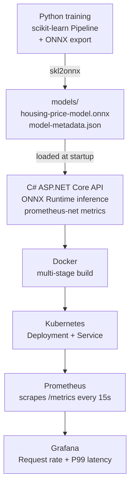
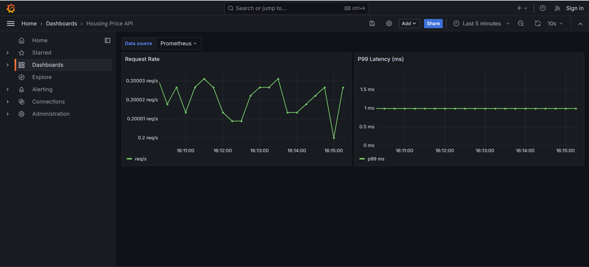

# .NET Housing Price API

[](https://github.com/stacknerdjoe/dotnet-housing-price-api/actions/workflows/build.yml)
[](https://github.com/stacknerdjoe/dotnet-housing-price-api/actions/workflows/test.yml)

I built a REST API that predicts Stockholm apartment prices using a machine learning model. Here's what I built and how it fits together:

- Trained a regression model in Python using scikit-learn, with a pipeline that handles one-hot encoding of Stockholm neighbourhood names and price prediction from size, rooms, and monthly fee
- Exported the trained model to ONNX using skl2onnx, with a separate verification step confirming the ONNX output matches the original sklearn predictions to within floating-point rounding
- Built a C# ASP.NET Core API on .NET 10 that loads the ONNX model at startup via Microsoft.ML.OnnxRuntime and serves predictions — no Python process at inference time, no second runtime in the container
- Added area name normalization so "Sodermalm", "Södermalm", and "SODERMALM" all resolve to the same model input, with clean 400 responses for unrecognized areas instead of silently wrong predictions
- Containerized the API with a multi-stage Docker build, pinning the runtime identifier consistently between restore and publish to ensure all NuGet assemblies land in the output
- Deployed to a local Kubernetes cluster via Docker Desktop, using a local registry to work around the cluster's image caching behavior
- Wired up Prometheus metrics via prometheus-net and built a Grafana dashboard showing real-time request rate and P99 latency, both confirmed live with actual traffic data
- Set up GitHub Actions with a test workflow on every PR and a build + test workflow on every push to main

The training data is synthetic, generated with realistic relative price differentials between Stockholm neighbourhoods — Östermalm and Vasastan priced significantly above outer areas like Skärholmen and Hässelby. The point of this project is the engineering pipeline, not housing market accuracy.

## Architecture



One deliberate constraint: Python is only used for training. The API loads the exported ONNX model directly via Microsoft.ML.OnnxRuntime — no Python process runs at inference time, no second runtime in the container.

## Prediction example

```http
POST /predict
Content-Type: application/json

{
  "area": "Södermalm",
  "rooms": 2,
  "size": 55,
  "monthlyFee": 3200
}
```

```json
{
  "estimatedPrice": 5081884,
  "currency": "SEK"
}
```

The `area` field is normalized before inference — "Sodermalm", "Södermalm", and "SODERMALM" all resolve to the same model input. An unrecognized area returns a 400 with the list of valid values instead of silently producing a wrong prediction (which is what the model would do if the one-hot encoding fell through with an unknown string).

## Endpoints

| Method | Path | Description |
|---|---|---|
| GET | `/health` | Liveness check |
| GET | `/model-info` | Model version, training date, valid area values |
| POST | `/predict` | Run inference |
| GET | `/metrics` | Prometheus text format metrics |

## Tech stack

**API**: C#, ASP.NET Core, .NET 10, ONNX Runtime, prometheus-net
**ML training**: Python, scikit-learn, pandas, skl2onnx
**Infrastructure**: Docker (multi-stage build), Kubernetes, local registry
**Monitoring**: Prometheus, Grafana
**CI/CD**: GitHub Actions (test on PR, build + test on merge to main)
**Testing**: xUnit

## Things I found interesting while building this

The biggest non-obvious issue was a .NET publish flag mismatch: `dotnet restore --runtime linux-x64` writes a lock file with RID-specific package paths, but `dotnet publish --no-restore` (without the matching `--runtime` flag) resolves the "portable" fallback paths instead — silently dropping platform-specific assemblies like prometheus-net from the output. The fix is making both commands use identical flags. It's the kind of thing that only surfaces when you inspect the actual published output rather than trusting the build succeeded.

The other one: `imagePullPolicy: Never` doesn't actually prevent Kubernetes from using a stale cached image — it prevents it from pulling a new one if a cached version exists. On Docker Desktop, the node image cache persists across daemon restarts, which means rebuilding the image doesn't guarantee the cluster picks it up. Switching to `Always` is the right call for a local development setup with a local registry, even though it adds a registry round-trip on every pod start.

## Screenshots



## Running locally

**Train the model** (one-time, or after changing the training data):

```bash
cd stockholm-housing-price-predictor
python -m venv .venv
# Windows:
.\.venv\Scripts\Activate.ps1
# macOS/Linux:
source .venv/bin/activate

pip install -r training/requirements.txt
python training/generate_data.py
python training/train.py
python training/export_onnx.py
python training/verify_onnx.py   # confirms sklearn and ONNX predictions agree
```

**Run the API locally:**

```bash
dotnet run --project src/HousingPrice.Api
```

**Run tests:**

```bash
dotnet test
```

**Build and run in Docker:**

```bash
docker build -t housing-price-api:latest .
docker run --rm -p 5009:8080 housing-price-api:latest
```

## Kubernetes deployment (local cluster)

Requires Docker Desktop with Kubernetes enabled and a local registry running:

```bash
docker run -d -p 5000:5000 --name registry registry:2
docker tag housing-price-api:latest localhost:5000/housing-price-api:latest
docker push localhost:5000/housing-price-api:latest

kubectl apply -f k8s/deployment.yaml -f k8s/service.yaml
kubectl apply -f k8s/monitoring.yaml

# Access the API (NodePort direct access unreliable on Docker Desktop Windows)
kubectl port-forward svc/housing-price-api 8888:80

# Access Prometheus
kubectl port-forward svc/prometheus 9090:9090

# Access Grafana (no login required)
kubectl port-forward svc/grafana 3000:3000
# Open http://localhost:3000 → Dashboards → Housing Price API
```

Note: `imagePullPolicy: Always` is set in the deployment so the cluster always pulls the latest image from the local registry rather than serving a stale cached version.